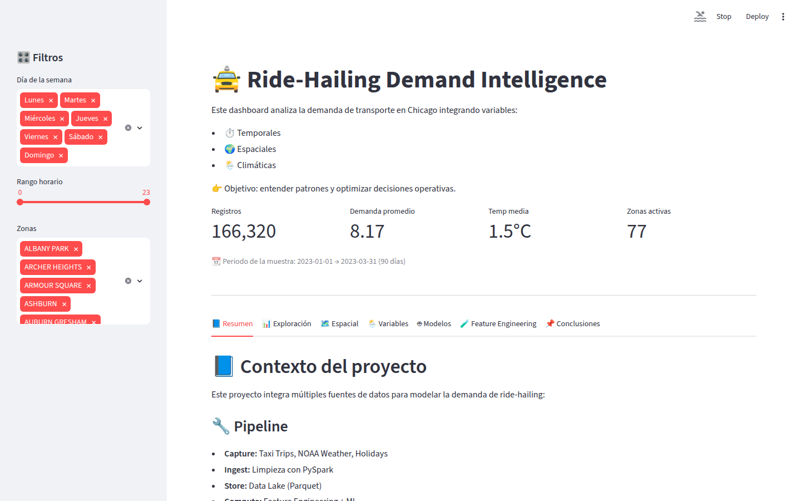
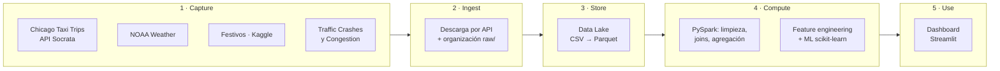
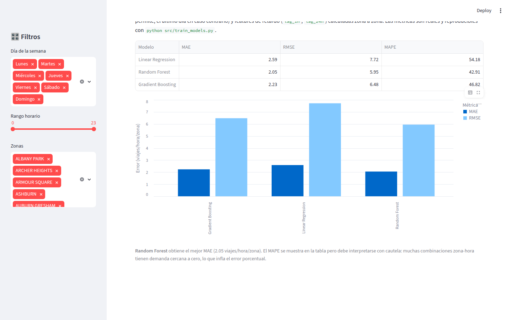
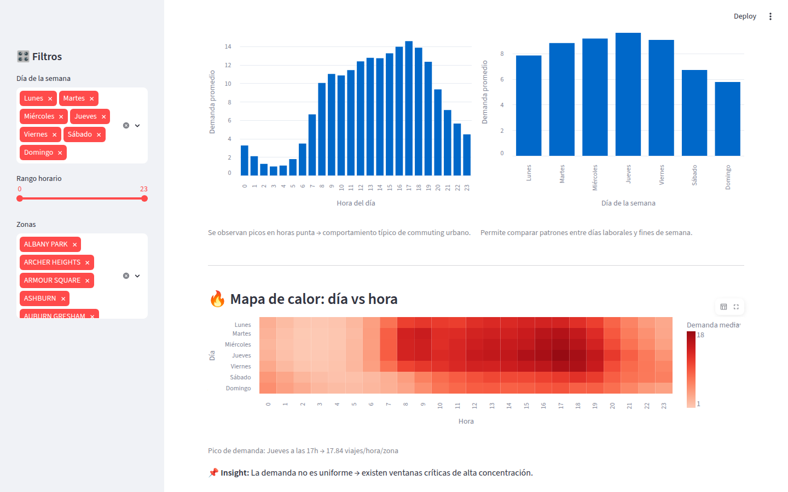
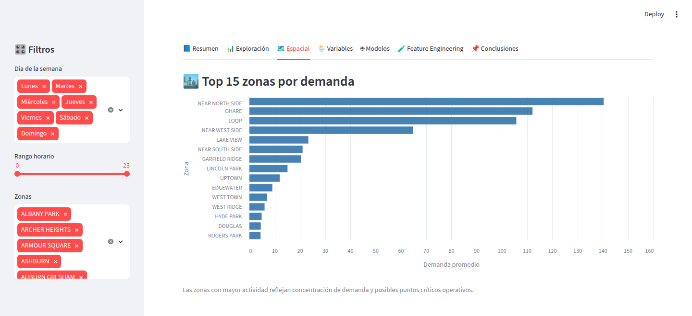
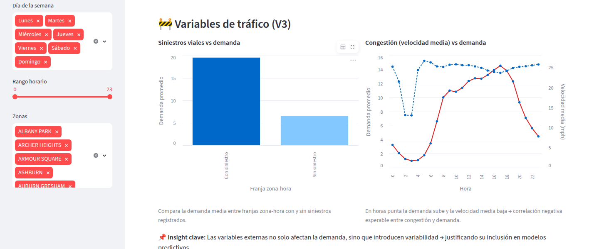

# 🚖 Ride-Hailing Demand Intelligence — Chicago

[](https://www.python.org/)
[](https://spark.apache.org/docs/latest/api/python/)
[](https://streamlit.io/)
[](https://scikit-learn.org/)
[](LICENSE)

Proyecto **end-to-end de Data Science y Big Data**: análisis y predicción espacio-temporal de la demanda de servicios de ride-hailing en Chicago, desde la ingesta distribuida de datos con **Apache Spark** hasta un **dashboard interactivo en Streamlit** con modelos de Machine Learning evaluados con validación temporal.

### 🔴 Demo en vivo

**👉 [ridehailing-demand-dashboard.streamlit.app](https://ridehailing-demand-dashboard-8tlsffpqh7rnwgowc95ljh.streamlit.app/)**



El dashboard opera sobre el dataset analítico completo generado por el pipeline: **90 días** (enero–marzo de 2023) × 24 horas × 77 zonas de Chicago, con variables temporales, espaciales, climáticas, de festivos y de tráfico.

---

## 🎯 El problema

La demanda de transporte urbano es altamente variable: depende de la hora, la zona, el clima y el calendario. Estimar correctamente cuántos viajes se solicitarán en cada zona y franja horaria permite **optimizar la asignación de flotas, reducir tiempos de espera y mejorar la eficiencia operativa**.

Este proyecto construye un pipeline completo que integra fuentes heterogéneas (viajes, meteorología, festivos, tráfico) y entrena modelos predictivos de demanda a nivel **zona × hora**.

---

## 🧱 Arquitectura (5 capas)



| Capa | Qué se hace | Tecnología |
|---|---|---|
| **Capture** | Identificación de fuentes: Taxi Trips, Taxi Zones, NOAA Weather, festivos, siniestros y congestión de tráfico | APIs Socrata/NOAA, Kaggle |
| **Ingest** | Descarga programática, verificación y organización por fuente | Python, requests, Kaggle API |
| **Store** | Data Lake con capa *raw* (CSV) y *curated* (Parquet) | Parquet, Google Drive |
| **Compute** | Limpieza, joins entre fuentes, agregación zona×hora, feature engineering y modelado | PySpark, pandas, scikit-learn |
| **Use** | Dashboard interactivo con exploración, mapas y comparación de modelos | Streamlit, Altair, Folium |

El pipeline completo está documentado y comentado en [`notebooks/ride_hailing_demand_pipeline.ipynb`](notebooks/ride_hailing_demand_pipeline.ipynb).

---

## 🔬 Metodología destacada

- **Features de retardo sin leakage**: `lag_1h` y `lag_24h` calculadas **zona a zona** (groupby + shift sobre datos ordenados cronológicamente), usando solo información disponible en producción.
- **Split temporal estricto**: nunca se mezclan pasado y futuro; el test es siempre un periodo posterior completo al entrenamiento.
- **Validación rolling-window** (en el notebook): 4 ventanas de test consecutivas con entrenamiento expansivo, reportando media ± desviación del error.
- **Estudio de ablación**: cada modelo se entrena con y sin lags sobre exactamente el mismo train/test para aislar el aporte real de las features.
- **Métricas honestas y reproducibles**: las métricas del dashboard no están hardcodeadas; las genera [`src/train_models.py`](src/train_models.py) sobre los datos del repositorio.

---

## 🤖 Resultados de los modelos

Métricas sobre el dataset completo de 90 días (test = última semana natural completa, 25–31 de marzo de 2023, split temporal). Reproducibles con `python src/train_models.py`:

| Modelo | MAE (con lags) | RMSE (con lags) | MAE (sin lags) |
|---|---:|---:|---:|
| Linear Regression | 2.59 | 7.72 | 12.39 |
| **Random Forest** | **2.05** | **5.95** | 2.36 |
| Gradient Boosting | 2.23 | 6.48 | 5.45 |

**Lecturas clave:**

- **Random Forest** es el mejor modelo en MAE y RMSE sobre el dataset completo.
- Las **features de lag reducen el error de forma drástica** en Linear Regression y Gradient Boosting (hasta 5 veces menos error); en Random Forest el margen es menor porque el modelo ya captura buena parte del patrón horario a través del resto de variables.
- El MAPE debe interpretarse con cautela en este problema: muchas combinaciones zona-hora tienen demanda cercana a cero, lo que infla el error porcentual.



---

## 📊 El dashboard

**[Pruébalo en vivo →](https://ridehailing-demand-dashboard-8tlsffpqh7rnwgowc95ljh.streamlit.app/)**

Siete pestañas: resumen del proyecto, exploración temporal, análisis espacial, impacto de variables externas, comparación de modelos, estudio de feature engineering y conclusiones. Todas las vistas temporales muestran los días de la semana con su nombre, ordenados de lunes a domingo.

**Patrones temporales** — heatmap día × hora con picos de commuting claramente visibles entre semana y una demanda notablemente menor el fin de semana:



**Concentración espacial** — Near North Side y el Loop dominan la demanda; O'Hare aparece como el segundo polo en volumen, aislado del clúster urbano central (la app incluye además un mapa coroplético interactivo por *community area*):



**Variables de tráfico (V3)** — la demanda es casi 3 veces mayor en franjas zona-hora con siniestros registrados, y la congestión (velocidad media) cae justo cuando sube la demanda en hora punta:



---

## 🚀 Cómo ejecutarlo

```bash
git clone https://github.com/Grohle/Ridehailing-demand-dashboard.git
cd Ridehailing-demand-dashboard

python -m venv .venv && source .venv/bin/activate   # en Windows: .venv\Scripts\activate
pip install -r requirements.txt

# (opcional) regenerar las métricas de los modelos
python src/train_models.py

# lanzar el dashboard
streamlit run app.py
```

El notebook del pipeline completo (`notebooks/`) está pensado para **Google Colab**: monta Google Drive como Data Lake y descarga los datos originales desde las APIs de Chicago, NOAA y Kaggle (requiere `kaggle.json` propio).

---

## 📁 Estructura del repositorio

```
├── app.py                    # Dashboard Streamlit (capa Use)
├── src/
│   └── train_models.py       # Entrenamiento y evaluación reproducible de los modelos
├── notebooks/
│   └── ride_hailing_demand_pipeline.ipynb   # Pipeline completo (5 capas, PySpark)
├── data/
│   ├── final_dataset.csv     # Dataset analítico zona×hora (90 días, 77 zonas)
│   ├── chicago_geo.json      # GeoJSON de community areas de Chicago
│   └── model_metrics.csv     # Métricas generadas por src/train_models.py
├── assets/                   # Capturas del dashboard
├── requirements.txt
└── LICENSE
```

> **Nota sobre los datos:** el repo incluye el dataset analítico completo generado por el pipeline (90 días × 24 h × 77 zonas = 166.320 filas, enero–marzo de 2023), con variables temporales, espaciales, climáticas, de festivos y de tráfico (siniestros y congestión). Es exactamente el dataset que produce el notebook en su capa `curated/`, exportado a CSV para que el dashboard y el entrenamiento sean reproducibles sin necesidad de una sesión de Spark.

---

## 📚 Fuentes de datos

| Dataset | Fuente |
|---|---|
| Chicago Taxi Trips | [Chicago Data Portal (Socrata)](https://data.cityofchicago.org/Transportation/Taxi-Trips/wrvz-psew) |
| Chicago Community Areas | [Chicago Data Portal](https://data.cityofchicago.org/Facilities-Geographic-Boundaries/Boundaries-Community-Areas-current-/cauq-8yn6) |
| Meteorología | [NOAA Climate Data](https://www.ncdc.noaa.gov/cdo-web/) |
| Festivos EE. UU. | [Kaggle — World Countries Holidays 2023](https://www.kaggle.com/datasets/dhavalrupapara/world-countries-holidays-dataset-2023) |
| Traffic Crashes / Congestion | [Chicago Data Portal](https://data.cityofchicago.org/) |

---

## ⚖️ Consideraciones éticas

El análisis revela un **sesgo espacial**: la demanda (y por tanto el modelo) se concentra en zonas de alta renta y turismo, dejando infrarrepresentado el sur de Chicago. Un despliegue real debería incorporar **criterios de equidad territorial** (cobertura mínima por zona) además de la pura eficiencia.

---

## 👥 Autores

Proyecto final del **Máster en Data Science y Big Data**:

- Alberto Miranda
- María José Mangas Gutiérrez
- Santiago Ricardo José Mendoza

Distribuido bajo licencia [MIT](LICENSE).
